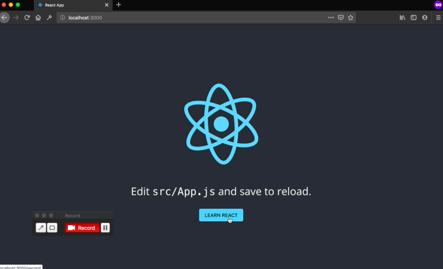

# React.js

Прежде чем мы приступим к делу, скажем пару слов о том, почему React можно считать наилучшей альтернативой среди средств для разработки веб-интерфейсов.


### **Декларативный подход к описанию интерфейсов**

React-разработка заключается в описании того, что нужно вывести на страницу (а не в составлении инструкций для браузера, посвящённых тому, как это делать). Это, кроме прочего, означает значительное сокращение объёмов шаблонного кода.


### **Чёткий синтаксис**

В React применяется синтаксис JSX, который **воспринимается** как обычный HTML (но не является ни строкой, ни HTML). Он максимально ясно описывает внешний вид UI, одновременно включая в себя всю мощь JavaScript. Вот как это выглядит:

```
const element = <h1>Hello, world!</h1>;

const Greetings = ({ firstName }) => (
   <div>Hi, {firstName}</div> // в JSX фигурные скобки используются для выражений
);
```
Подробнее о [выражениях](https://developer.mozilla.org/en-US/docs/Web/JavaScript/Guide/Expressions_and_Operators#Expressions).


### **Особенности механизма привязки данных**

В React используется односторонняя привязка данных: от родительского элемента к дочерним. Это — большой плюс: вы всегда знаете что привело к изменению состояния приложения. Подобный подход к привязке данных значительно упрощает отладку.


### **Механики из графичеких редакторов**

Компонентный подход React похож на компоненты Figma или символы Sketch. Компоненты можно вкладывать друг в друга и переопределять стили.


### **Легкий старт**

Кривая обучения — это важный фактор, который нужно учитывать при выборе UI-фреймворка. В этой связи надо отметить, что в React имеется меньше абстракций, чем, скажем, в Angular. Для того, чтобы разобраться, потребуется некоторое время, но приступить к работе можно **очень и очень быстро**.


# Материалы по react.js  

Официальная документация: [en](https://reactjs.org/) [ru](https://ru.reactjs.org/)  

[Шпаргалка по библиотеке](https://devhints.io/react) для версий 15 и 16 (en)  
  *кратко изложены методы и подходы в виде сниппетов кода*

Книга [Реакт быстро](https://www.ozon.ru/context/detail/id/149669993/) (ru)  
  *подробное, пошаговое описание для старта работы (максимально развернуто)*

[Видео](https://youtu.be/gRs7NbEZMCg) основы React от создателя Framer (en)  
  *нет описания*

Видеокурс [основы React](https://www.youtube.com/playlist?list=PLD-piGJ3Dtl0WEK67FD1bUGryqqaY_eU-) (ru)  
  *база для старта*

[Книга-курс](https://maxfarseer.gitbooks.io/react-course-ru-v2/content/) для начинающих (ru)  
  *пошаговое создание небольшого приложения новостей (добавление, просмотр "подробнее")*

[Видео-курс](https://scrimba.com/playlist/p7P5Hd) с практикой (en)  
  *пошаговое создание to do app*

Курс Евгения Родионова: [этап 1](https://erodionov.ru/courses/react/9wO7ihaBIk), [этап 2](https://erodionov.ru/courses/react/rHAh7OXEFL), [этап 3](https://erodionov.ru/courses/react/tHKYMIR4QG) (ru)  
  *нет описания*

Всё, что нужно знать, чтобы [войти в React](https://medium.com/@stasonmars/%D0%B2%D1%81%D0%B5-%D1%87%D1%82%D0%BE-%D0%BD%D1%83%D0%B6%D0%BD%D0%BE-%D0%B7%D0%BD%D0%B0%D1%82%D1%8C-%D1%87%D1%82%D0%BE%D0%B1%D1%8B-%D0%B2%D0%BE%D0%B9%D1%82%D0%B8-%D0%B2-react-%D0%B2-2018-%D0%B3%D0%BE%D0%B4%D1%83-bdbf3a776d21)  
*статья с основными концепциями*


<!-- # Ссылки js

[Опыт программирования на javascript](https://kaineer.gitbooks.io/coding-in-javascript/)  
[Базовый курс](https://code-basics.ru/languages/javascript) от Hexlet (ru) -->


# Необходимые знания

html, css. javascript:

- Типы данных [mdn](https://developer.mozilla.org/ru/docs/Web/JavaScript/Data_structures), [learnjs](http://learn.javascript.ru/types-intro)  
- Массивы [mdn](https://developer.mozilla.org/en-US/docs/Learn/JavaScript/First_steps/Arrays)
Методы работы с массивами: [filter](https://developer.mozilla.org/en-US/docs/Web/JavaScript/Reference/Global_Objects/Array/filter), [map](https://developer.mozilla.org/en-US/docs/Web/JavaScript/Reference/Global_Objects/Array/map), [reduce](https://developer.mozilla.org/en-US/docs/Web/JavaScript/Reference/Global_Objects/Array/reduce), [find](https://developer.mozilla.org/en-US/docs/Web/JavaScript/Reference/Global_Objects/Array/find), библиотека [lodash](https://lodash.com/)  
- Шаблонные строки  [mdn](hhttps://developer.mozilla.org/ru/docs/Web/JavaScript/Reference/template_strings), [learnjs](https://learn.javascript.ru/es-string) (обратите внимание на \`**кавычки**\`)  
- Циклы [mdn](https://developer.mozilla.org/en-US/docs/Web/JavaScript/Guide/Loops_and_iteration), [learnjs](https://learn.javascript.ru/while-for)  
- Функции [mdn](https://developer.mozilla.org/ru/docs/Web/JavaScript/Guide/Functions) (обратите внимание на краткую запись =>, скоуп)
- Модули [import, export](https://learn.javascript.ru/modules), модули [в рамках React](https://www.geeksforgeeks.org/reactjs-importing-exporting/), [шпаргалка](https://stackoverflow.com/questions/36795819/when-should-i-use-curly-braces-for-es6-import/36796281#36796281) на stackoverflow  
- Объекты [mdn](https://developer.mozilla.org/en-US/docs/Web/JavaScript/Reference/Global_Objects/Object)  
- События [mdn](https://developer.mozilla.org/en-US/docs/Web/API/Event). Что такое [preventDefault](https://developer.mozilla.org/en-US/docs/Web/API/Event/preventDefault), [stopPropagation](https://developer.mozilla.org/en-US/docs/Web/API/Event/stopPropagation)  
- [Классы](https://getinstance.info/articles/react/react-and-es6-part2/) в React 
- DOM в React, [как работает](https://reactjs.org/docs/faq-internals.html). [Схема работы](https://images.app.goo.gl/qr4ewDahPrLmiQ559)  
- LifeCycle [оф.документация](https://reactjs.org/docs/state-and-lifecycle.html). Статьи по теме: [1](https://tproger.ru/translations/react-after-learning-basics/), [2](https://habr.com/ru/post/358090/), [3](https://medium.com/@it_root.corp/react-component-life-cycle-bbe583ca4cb)  
- Routing. Как работает [1](http://prgssr.ru/development/pogruzhenie-v-react-router.html), [2](https://getinstance.info/articles/react/learning-react-router/). [Туториал](https://habr.com/ru/post/329996/)


# Простое приложение  

**!** Автор тутора предполагает, что вы ознакомились с базой js и базой библиотеки React. Задания направлены на закрепление знаний и привыкание к синтаксису.  
**!** Для мышечной памяти весь код шагов **рекомендуется переписывать самостоятельно**, а не копировать.  

### **Установка**  

Для удобства в репозитории уже есть `create-react-app`. Клоним, устанавливаем зависимости:
```
git clone https://github.com/object-of-obsession/react.git
cd react
npm i
```


### **Cтруктура**  
```
app
├── README.md
├── node_modules
├── package.json
├── .gitignore
├── public
│   ├── favicon.ico
│   ├── index.html        // здесь будет рендериться приложение
│   └── manifest.json     // манифест
└── src
    ├── App.css           // стили компонента App
    ├── App.js            // файл компонента App
    ├── App.test.js       // тесты компонента App
    ├── index.css         // стили страницы index.html
    ├── index.js          // файл с инструкцией рендеринга
    ├── logo.svg          // графика, используемая в приложении
    └── serviceWorker.js  // файл сервис-воркера
```

Почитать про [манифест](https://developer.mozilla.org/en-US/docs/Web/Manifest), [сервис-воркеры](https://developer.mozilla.org/en-US/docs/Web/API/Service_Worker_API/Using_Service_Workers)


### **Как тут всё работает, кратко**

<!-- Приложение смотрит компонент `App`, закидывая в него стили `App.css` и графику `logo.svg`. Затем файл `index.js` смотрит, что мы хотим отрендерить `App`   -->
<!--  -->
<!--  -->

В `index.js` описаны компоненты, которые необходимо отрендерить. В нашем случае это единственный `App`, но их может быть больше. Если импорт описан корректно, приложение смотрит внутрь каждого компонента и собирает сопутствующие файлы: для `App` это стили `App.css`, графика `logo.svg`. Далее метод `getElementById` находит контейнер с `id="root"` в `public/index.html` и рендерит в html-файле компонент `App`, попутно применяя к `index.html` стили `index.css`  

  

### **Файлы**

**index.js**
```jsx
                                                  // импорт
import React from 'react';                        // React
import ReactDOM from 'react-dom';                 // ReactDOM
import './index.css';                             // стили для index.html
import App from './App';                          // компонент App
import * as serviceWorker from './serviceWorker'; // сервис-воркер

// метод render модуля ReactDOM, на вход (в круглых скобках) принимает два аргумента:  
// компонент App и узел в html, где отрендерить компонент App*
ReactDOM.render(<App />, document.getElementById('root'));
```
\* если не импортировать модуль ```ReactDOM```, метод ```render``` не сработает, то же касается файла стилей. **Всегда следите за импортами**.


**index.html**
```html
...
<div id="root"></div> // здесь React рендерит компонент App
...
```

**App.js** (может иметь расширение как `js`, так и `jsx` — как вам нравится)
```jsx
                                  // импорт
import React from 'react';        // React, нужен для создания функционального компонента и читения JSX
import logo from './logo.svg';    // графика
import './App.css';               // стили компонента

// компонент App, функциональный*
function App() {
  return (
    <div className="App">
      <header className="App-header">
        
        <p>
          Edit <code>src/App.js</code> and save to reload.
        </p>
        <a
          className="App-link"
          href="https://reactjs.org"
          target="_blank"
          rel="noopener noreferrer"
        >
          Learn React
        </a>
      </header>
    </div>
  );
}

export default App; // экспорт компонента App
```
\* в React компоненты делятся на функциональные и классовые, [почитать](https://reactjs.org/docs/components-and-props.html)

Обратите внимание, что в теле `return` есть один общий `div` с `className="App"`, в него завернуто тело компонента. Дело в том, что в React функция может вернуть только один `div` — **ФОРМУЛИРОВКА ТРЕБУЕТ УТОЧНЕНИЯ РАЗРАБОТЧИКА**

Содержимое css файлов вам знакомо, сервис-воркеры не понадобятся.

# Практика  

В нашей обучалке мы закастомим `create-react-app`:
1. изменим структуру файлов
2. добавим несколько компонентов
3. научимся стилизовать компоненты
4. настроим роутинг

Этот флоу похож на некоторые моменты работы дизайнера в графических редакторах. Последний пункт поможет связывать разные страницы в рамках одной задачи.

Чтобы начать работу установите `react dev tools` для вашего браузера, в терминале выполните:
```
npm start
```


### **1. Новая структура файлов**

Компонентный подход — мощная парадигма, используемая в разработке и в дизайне. Если взглянуть на работу в Sketch, каждый символ лежит на своем артборде (в React символ = компонент). Попоробуем применить этот подход в проекте. Дефолтный `create-react-app` складывает файлы в `/src`. Если компонентов будет больше, поддержка затруднится.  

Вытащим комопнент `App.js`, `App.css`, `App.test.js` в свою папку c названием `App`. Получим структуру
внутри `src`:
```
└── src
    └── App
        ├── App.css
        ├── App.js
        └── App.test.js
    ├── index.css
    ├── index.js
    ├── logo.svg
    └── serviceWorker.js
```

Если вы успели посмотреть, страница браузера/консоль/терминал выдают ошибку:
```
Failed to compile.
...
Error: ENOENT: no such file or directory / can't resolve path ...
```
Мы переместили файлы, но не изменили пути импорта. Без исправления билд не запустится.  
Посомтрим в `index.js`. Он использует перемещённый компонент `App`. 
```jsx
// index.js
import App from './App';
```
`./` означает, что `index.js` будет искать компонент в `src` (в той папке, где находится сам), нам нужна папка с имененем компонента `App`:
```jsx
// index.js
import App from './App/App';
```
**Есть еще ошибка, связанная с svg-файлом. Попробуйте разобраться в чем дело.**  

Все новые компоненты будем складывать по папкам с именем компонента в `/src`, имя папки должно начинаться с большой буквы, так React поймет, что это хранилище компонета. Если все ок, приступаем ко второму шагу.


### **2. Добавим компоненты**

Пока у нас есть единственный функциональный компонент `App`. Добавим еще один компонент, но [классовый](https://reactjs.org/docs/react-component.html). Чтобы не возиться с версткой, вытащим тег \<p> и его содержимое из `App.js` и сделаем его компонентом.
```jsx
// App.js
<p>
  Edit <code>src/App.js</code> and save to reload.
</p>
```

Первым делом нужна папка с имененем компонента, назовём `Instruction`. Также в папке должен пристуствовать файл самого компонента `Instruction.jsx` (напомню, что файлы компонентов могут иметь расширения `.js` и `.jsx`. В данном случае нет связи с тем, что компонент классовый. Просто демонстрация что работает и так, и так). Получаем стуркутуру:

```
└── src
    └── App
        ├── App.css
        ├── App.js
        └── App.test.js
    └── Instruction
        └── Instruction.jsx
    ├── index.css
    ├── index.js
    ├── logo.svg
    └── serviceWorker.js
```

В файле компонента `Instruction`: 
```jsx
// Instruction.jsx

import React from 'react';

class Instruction extends React.Component {
    render() {
      return (
        <p>
            Edit <code>src/App.js</code> and save to reload.
        </p>
      )
    }
}

export default Instruction;
```

Сам по себе компонент `Instruction` так и останется лежать в своей директории, добавим его в компонет `App`:  
```jsx
// App.js

import React from 'react';
import logo from '../logo.svg';
import './App.css';
import Instruction from './Instruction';

function App() {
  return (
    <div className="App">
      <header className="App-header">
        

        // добавили компонент Instruction
        <Instruction />
        
        <a
          className="App-link"
          href="https://reactjs.org"
          target="_blank"
          rel="noopener noreferrer"
        >
          Learn React
        </a>
      </header>
    </div>
  );
}
```

**Задание**: В снипете выше для `App.js` есть ошибка с импортом, попробуйте исправить её.  

Если все верно, в ReactDevTools вы увидите компонент `Instruction`, отрендеренный внутри `App`.
  

**Задание**: в компоненте `App` есть ссылка с текстом *Learn React*. Попробуйте создать классовый или функциональный компонент с названием  `Button` и заменить ссылку на кнопку. Кнопку можно сделать html-тегом `button`, поведение ссылки можно не сохранять. Позже мы закастомим эту кнопку. На выходе получится так:
  

Мы добавили два компонента `Instruction` и ` Button` в `App`. Компоненты могут вкладывать друг в друга солько угодно, главное держать ситуацию под контролем.


### **3. Стили**

В React существет несколько способов применения стилей. В этом туториале рассмотрим CSS модули, так как этот подход наиболее близок к обычной реализации через отдельные CSS файлы и классы.

Если вы обратили внимание, в директории компонента `App` есть файл `App.css`, он подключается в `App.js` в качестве модуля. Внутри обычный css, но собака зарыта в описании классов JSX. Так как слово `class` зарезервировано в js, создатели React придумали писать `className="..."`.  

Давайте **закастомим кнопку** из предыдущего задания. В репозитории лежит файл со стилями кнопки `tutorial_assets/Button.css`. Попробуйте применить его к компоненту `Button`.

Вторым шагом **закастомим компонент** `Instruction`: подключите в его css файл гарнитуру Open Sans по cdn:
```css
@import url('https://fonts.googleapis.com/css?family=Open+Sans');
```
Стиль для текста на ваш вкус.

Мы закастомили компоненты приложения, обязательно ознакомьтесь с другими способами [стилизации в React](https://medium.com/@stasonmars/%D1%80%D1%83%D0%BA%D0%BE%D0%B2%D0%BE%D0%B4%D1%81%D1%82%D0%B2%D0%BE-%D0%BF%D0%BE-%D1%82%D1%80%D1%91%D0%BC-%D1%81%D0%BF%D0%BE%D1%81%D0%BE%D0%B1%D0%B0%D0%BC-%D1%81%D1%82%D0%B8%D0%BB%D0%B8%D0%B7%D0%B0%D1%86%D0%B8%D0%B8-%D0%B2-react-2ca5c0c7464b).

### **4. Роутинг**

В React есть своя система маршрутизации, которая позволяет сопоставлять запросы к приложению с определенными компонентами, другими словами переходить по страницам или менять часть контента страницы по ивенту. Ключевым звеном в работе маршрутизации является модуль [react-router](https://www.npmjs.com/package/react-router), который содержит основной функционал по работе с маршрутизацией. Однако если мы собираемся работать в браузере, нам надо использовать модуль [react-router-dom](https://reacttraining.com/react-router/web/guides/quick-start). Чтобы использовать его в туторе выполните:
```
npm i react-router-dom
```

Ознакомьтесь с [базовыми подходами роутинга](https://getinstance.info/articles/react/learning-react-router/) перед началом практики.  

Попробуем простой пример. Нам нужно сделать переход между двумя страницами по клику на кнопку. В компоненте `App` уже есть компонент с кнопкой `Button`, а сам `App` является первой страницей.  

**Создайте компонент второй страницы** с именеем `Second`. В нем помимо прочих должны быть импортированы модули из `react-router-dom`:
```
import { BrowserRouter as Router, Link } from "react-router-dom";
```
`Second` будет возвращать следующую разметку:
```jsx
<div style={{ margin: '20px' }}>
  ← Go back to App
</div>
```
Позже этот текст  станет контролом, который будет возвращать пользователя на первую страницу. Обратите внимание,  используется [инлайновая стилизация JSX](https://blog.cloudboost.io/using-inline-styles-in-jsx-c1d03cbe6fe0).

Теперь надо научить приложение видеть разные страницы и использовать правильный путь при переходе. Для этого `Router` нужно передать как аргумент в метод `ReactDOM.render` вместо `App`:
```jsx
// index.js

// ReactDOM.render(<App />, document.getElementById('root')); строку можно удалить
ReactDOM.render((
    <Router>
        <Route path="/" component={App} />            // роут 1
        <Route path="/second" component={Second} />   // роут 2
    </Router>
), document.getElementById('root'));
```
Роут 1 говорит, что компонент `App` будет показан по адресу `http://localhost:3000/`.  
Роут 2 говорит, что компонент `Second` будет показан по адресу `http://localhost:3000/second`.  
Таким образом в div с `root` в зависимости от адреса будут рендериться разные компоненты.

Любой Route может иметь [параметр `exact`](https://stackoverflow.com/questions/49162311/react-difference-between-route-exact-path-and-route-path).

Контролам тоже нужна инструкция для перехода. Компонет `Button` ведет на страницу `Second`, значит он должен возвращать помимо кнопки еще и ссылку:
```jsx
import React from "react"
import "./Button.css"
import { BrowserRouter as Router, Link } from "react-router-dom"; // добавлены модули для роутинга

function Button() {
    return (
        <Link to="/second">   // кнопка завернута в линк со ссылкой на нужный адрес
            <button className="button">Learn React</button>
        </Link>
    )
}

export default Button;
```
Попробуйте обновить сборку и посмотреть, работает ли переход. Должен работать в одну сторону, обратно вернуться нельзя. Это из-за того, что в компоненте `Second` текст `← Go back to App` еще не стал ссылкой и не получил адрес.  
**Попробуйте сделать это самостоятельно.**  

Если все правильно, приложение должно работать так:  
  


# Финал  
Попробуйте пройтись взглядом по всем файлам в `/src` и вспомнить смысл кода. Также полезно заглянуть в ReactDevTools на каждой странице — в работе с React этот плагин более информативен, чем инспектор браузера.

Если у вас есть предложения, присылайте в [issues](https://github.com/object-of-obsession/react/issues).

<!-- # Источники

[React.js: понятное руководство для начинающих](https://habr.com/ru/company/ruvds/blog/428077/)
[Определение маршрутов](https://metanit.com/web/react/4.1.php)
[text](#adress) 

-->